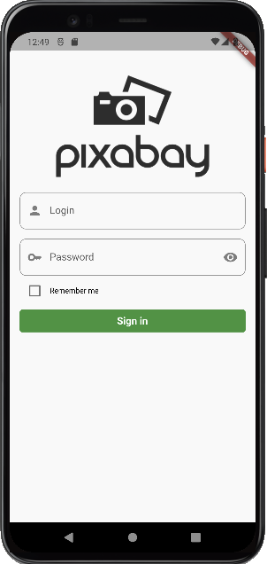
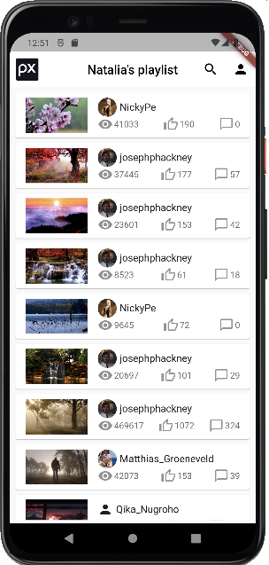
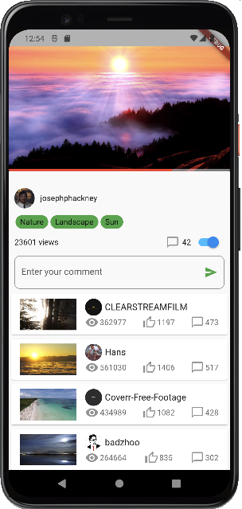
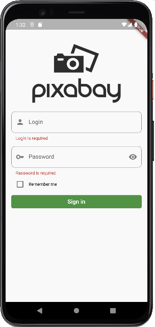
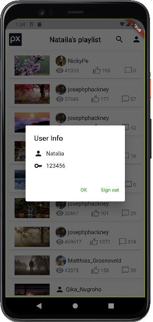

# Video Browser and Player

A video browser project created in Flutter using free stock videos from [Pixabay](https://pixabay.com/videos/).

## Getting Started

This application allows user to browse videos, to play selected video and to show relative videos. The login and password can be any, but not null.

## Supported Platforms

This project was run and tested on 
* iOS 14.4 
* Android 12.0

## Features

The project has the following features:
* Sign in/ Sign out
* Validation
* Play video
* Write a comment (comments are not saved, the total count of comments increments)
* Toggle on/off comments

## To Do's:
* Search

## Libraries

* [http](https://pub.dev/packages/http)
* [pod_player](https://pub.dev/packages/pod_player)

## Folder Structure

Here is the folder structure of this project:
```
lib/
|- model/
|- pages/
|- utilities/
|- widgets/
|- main.dart
```

Now, lets explain all:
```
1- model        - Contains data used in the application (user, video info).
2- pages        - Contains all the screen/ui of the application.
3- utilities    - Contains constans and extentions which are used throughout the application.
4- widgets      - Contains the common widgets for the application.
5- main.dart    - The starting point of the application.
```

### Model

All the business logic of the apllication is in this directory. The Models folder contains the models of the application each in it own dart file.
```
model/
|- user.dart    - User model (login, password)
|- video.dart   - Video model (video info and functions that make HTTP requests to [Pixabay](https://pixabay.com/videos/))
```

### Pages

Pages contains the various pages or screens of the application. 
```
pages/
|- login_page.dart          - Login page
|- video_list_page.dart     - Video list page
|- video_page.dart          - Single video page
```

### Utilities

Contains constans and extentions which are used throughout the application.
```
utilities/
|- constants.dart   - Constants used in projects
|- string.dart      - Extension of string type 
```

### Widgets

Contains the common widgets that are shared across multiple screens.
```
widgets/
|- user_info_widget.dart            - Widget with user info (login, password)
|- video_list_tile_widget.dart      - List tile widget
```

## Screenshots

Authentication:<br/>
 

Overview of all videos:<br/>
 

Video player page with related videos (by tags) and comment box:<br/>


Fields validation:<br/>


User info:<br/>


## Overview


## License

The repository's code and contents are distributed under the [MIT License](https://github.com/aaronoe/FlutterCinematic/blob/master/LICENSE "Project License").